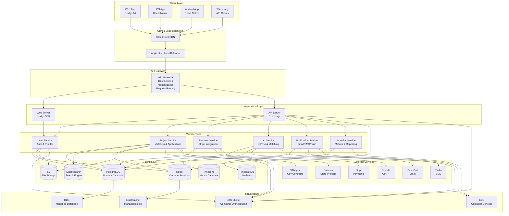
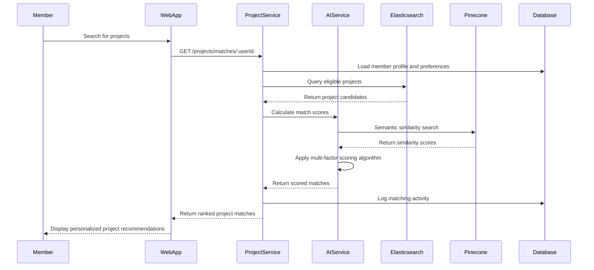
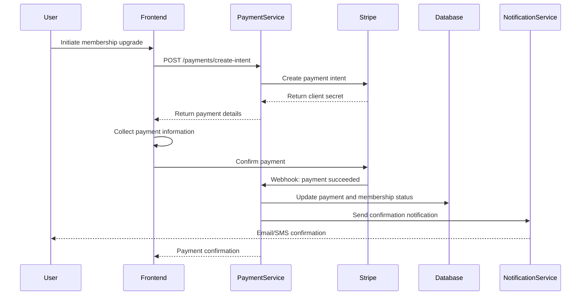
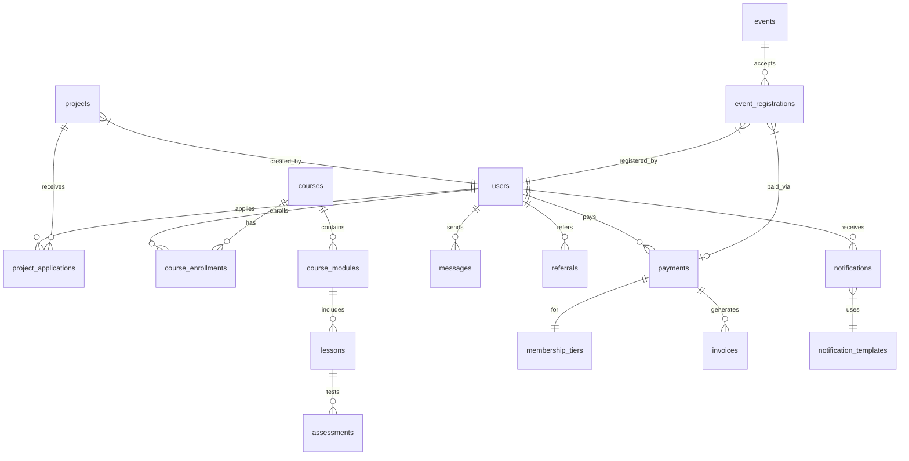
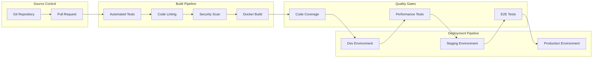

# NAMC NorCal Member Portal - Technical Architecture

*Comprehensive system design and infrastructure documentation*

## 📊 Architecture Overview

### High-Level System Architecture



## 🏗️ Service Architecture

### Core Services Design

#### 1. User Service
**Responsibilities**: Authentication, authorization, user profiles, membership management

```typescript
interface UserServiceArchitecture {
  endpoints: {
    authentication: '/auth/*'
    profiles: '/users/*'
    roles: '/roles/*'
    permissions: '/permissions/*'
  }
  
  dependencies: {
    database: 'PostgreSQL (users, roles, permissions)'
    cache: 'Redis (sessions, permissions)'
    storage: 'S3 (profile images, documents)'
    external: ['Auth0 (optional)', 'CSLB API (license verification)']
  }
  
  features: [
    'JWT with refresh token rotation',
    'RBAC with granular permissions',
    'Multi-factor authentication (TOTP)',
    'Account lockout and rate limiting',
    'Comprehensive audit logging',
    'Social login integration ready'
  ]
}
```

#### 2. Project Service
**Responsibilities**: Project CRUD, matching algorithms, application workflows

```typescript
interface ProjectServiceArchitecture {
  endpoints: {
    projects: '/projects/*'
    applications: '/projects/*/applications'
    matching: '/projects/matches/*'
    search: '/projects/search'
  }
  
  dependencies: {
    database: 'PostgreSQL (projects, applications)'
    search: 'Elasticsearch (project search and indexing)'
    cache: 'Redis (search results, frequent queries)'
    storage: 'S3 (project documents, proposals)'
    external: ['SAM.gov API', 'Caltrans API', 'Dodge Data']
  }
  
  features: [
    'AI-powered project matching',
    'Real-time search with filters',
    'Application workflow management',
    'Geographic proximity scoring',
    'Automated project ingestion',
    'Compliance requirement tracking'
  ]
}
```

#### 3. AI Service
**Responsibilities**: Machine learning, project matching, bid assistance

```typescript
interface AIServiceArchitecture {
  endpoints: {
    matching: '/ai/match/*'
    assistance: '/ai/assist/*'
    feedback: '/ai/feedback'
    models: '/ai/models/*'
  }
  
  dependencies: {
    database: 'PostgreSQL (ai_feedback, ai_models)'
    vector: 'Pinecone (embeddings, similarity search)'
    cache: 'Redis (model results, frequent computations)'
    external: ['OpenAI GPT-4', 'OpenAI Embeddings']
  }
  
  features: [
    'Multi-factor project scoring algorithm',
    'Natural language RFP analysis',
    'Automated bid assistance',
    'Performance prediction models',
    'Continuous learning from feedback',
    'A/B testing for model improvements'
  ]
}
```

#### 4. Payment Service
**Responsibilities**: Payment processing, subscriptions, financial reporting

```typescript
interface PaymentServiceArchitecture {
  endpoints: {
    payments: '/payments/*'
    subscriptions: '/subscriptions/*'
    invoices: '/invoices/*'
    webhooks: '/payments/webhooks'
  }
  
  dependencies: {
    database: 'PostgreSQL (payments, invoices, subscriptions)'
    external: ['Stripe API', 'Stripe Webhooks']
    cache: 'Redis (payment status, session data)'
  }
  
  features: [
    'Stripe subscription management',
    'One-time payment processing',
    'Automated invoice generation',
    'Refund and chargeback handling',
    'Financial reporting and analytics',
    'PCI compliance framework'
  ]
}
```

### Data Flow Architecture

#### Project Matching Flow


#### Payment Processing Flow


## 🗄️ Database Architecture

### Database Design Principles

1. **Normalization**: 3NF compliance with strategic denormalization for performance
2. **Indexing Strategy**: Composite indexes for common query patterns
3. **Partitioning**: Time-based partitioning for audit logs and analytics
4. **Replication**: Read replicas for analytics and reporting queries
5. **Backup Strategy**: Continuous WAL-E backups with point-in-time recovery

### Primary Database Schema

```sql
-- Core user management with enhanced security
CREATE TABLE users (
  id TEXT PRIMARY KEY DEFAULT gen_random_uuid(),
  email TEXT UNIQUE NOT NULL,
  password_hash TEXT NOT NULL,
  first_name TEXT NOT NULL,
  last_name TEXT NOT NULL,
  company TEXT,
  phone TEXT,
  address JSONB, -- Structured address with geocoding
  member_type member_type_enum DEFAULT 'REGULAR',
  member_since TIMESTAMP DEFAULT NOW(),
  membership_expires_at TIMESTAMP,
  is_active BOOLEAN DEFAULT true,
  is_verified BOOLEAN DEFAULT false,
  
  -- Security and preferences
  failed_login_attempts INTEGER DEFAULT 0,
  locked_until TIMESTAMP,
  two_factor_enabled BOOLEAN DEFAULT false,
  two_factor_secret TEXT,
  notification_preferences JSONB DEFAULT '{"email": true, "sms": false, "push": true}',
  
  -- Audit fields
  created_at TIMESTAMP DEFAULT NOW(),
  updated_at TIMESTAMP DEFAULT NOW(),
  created_by TEXT,
  updated_by TEXT
);

-- Indexes for performance
CREATE INDEX idx_users_email ON users(email);
CREATE INDEX idx_users_member_type ON users(member_type) WHERE is_active = true;
CREATE INDEX idx_users_expires ON users(membership_expires_at) WHERE membership_expires_at IS NOT NULL;
CREATE INDEX idx_users_company ON users(company) WHERE company IS NOT NULL;

-- Geographic index for location-based queries
CREATE INDEX idx_users_location ON users USING GIST ((address->>'coordinates')::geography);
```

### Key Relationships



### Performance Optimization

#### Connection Pooling
```typescript
const poolConfig = {
  max: 20,          // Maximum connections
  idleTimeoutMillis: 30000,
  connectionTimeoutMillis: 2000,
  maxUses: 7500,    // Recycle connections
  allowExitOnIdle: true
};
```

#### Query Optimization
```sql
-- Efficient project matching query with geographic bounds
SELECT p.*, 
       ST_Distance(p.location, $userLocation) as distance,
       ts_rank(to_tsvector('english', p.title || ' ' || p.description), 
               plainto_tsquery('english', $searchTerms)) as text_score
FROM projects p
WHERE p.status = 'PUBLISHED'
  AND p.budget_min <= $userBudgetMax
  AND p.budget_max >= $userBudgetMin
  AND ST_DWithin(p.location, $userLocation, $maxDistance)
  AND p.skills && $userSkills
ORDER BY (text_score * 0.4 + (1.0 - distance/100000) * 0.6) DESC
LIMIT 50;
```

## 🔐 Security Architecture

### Authentication & Authorization Flow

```mermaid
graph LR
    subgraph "Authentication Layer"
        LOGIN[Login Request]
        MFA[2FA Verification]
        JWT_GEN[JWT Generation]
    end
    
    subgraph "Authorization Layer"  
        JWT_VAL[JWT Validation]
        RBAC[Role-Based Access Control]
        PERM_CHECK[Permission Check]
    end
    
    subgraph "Security Middleware"
        RATE_LIMIT[Rate Limiting]
        AUDIT_LOG[Audit Logging]
        CSRF[CSRF Protection]
    end
    
    LOGIN --> MFA
    MFA --> JWT_GEN
    JWT_GEN --> JWT_VAL
    JWT_VAL --> RBAC
    RBAC --> PERM_CHECK
    PERM_CHECK --> RATE_LIMIT
    RATE_LIMIT --> AUDIT_LOG
    AUDIT_LOG --> CSRF
```



### Security Layers

#### 1. Network Security
- **VPC Configuration**: Private subnets for databases and services
- **Security Groups**: Restrictive inbound/outbound rules
- **WAF Protection**: Application firewall with OWASP rule sets
- **DDoS Protection**: AWS Shield Advanced for critical endpoints

#### 2. Application Security
- **Input Validation**: Zod schemas for all user inputs
- **SQL Injection Prevention**: Parameterized queries only
- **XSS Protection**: Content Security Policy headers
- **CSRF Protection**: Signed tokens with SameSite cookies

#### 3. Data Security
- **Encryption at Rest**: AES-256 for database and file storage
- **Encryption in Transit**: TLS 1.3 for all communications
- **Key Management**: AWS KMS for encryption key rotation
- **PII Protection**: Tokenization for sensitive personal data

### Security Monitoring

```typescript
interface SecurityEvent {
  type: 'FAILED_LOGIN' | 'SUSPICIOUS_ACTIVITY' | 'PRIVILEGE_ESCALATION' | 'DATA_ACCESS'
  severity: 'LOW' | 'MEDIUM' | 'HIGH' | 'CRITICAL'
  userId?: string
  ipAddress: string
  userAgent: string
  resource: string
  details: Record<string, any>
  timestamp: Date
}

// Real-time security alerting
const securityAlerts = {
  failedLogins: { threshold: 5, window: '15m' },
  privilegeEscalation: { threshold: 1, window: '1m' },
  dataExfiltration: { threshold: 100, window: '5m' },
  suspiciousAccess: { threshold: 10, window: '1h' }
};
```

## 📊 Monitoring & Observability

### Application Performance Monitoring

```typescript
interface MetricsCollection {
  // Performance metrics
  responseTime: HistogramMetric
  throughput: CounterMetric
  errorRate: GaugeMetric
  
  // Business metrics
  userRegistrations: CounterMetric
  projectMatches: CounterMetric
  paymentSuccess: CounterMetric
  
  // System metrics
  databaseConnections: GaugeMetric
  memoryUsage: GaugeMetric
  cpuUtilization: GaugeMetric
}

// Custom dashboards for different stakeholders
const dashboards = {
  technical: ['response_time', 'error_rate', 'throughput', 'system_health'],
  business: ['user_growth', 'revenue', 'engagement', 'conversion_rates'],
  operations: ['uptime', 'alerts', 'capacity', 'costs']
};
```

### Logging Strategy

```typescript
// Structured logging with correlation IDs
interface LogEntry {
  timestamp: string
  level: 'DEBUG' | 'INFO' | 'WARN' | 'ERROR'
  service: string
  correlationId: string
  userId?: string
  message: string
  metadata: Record<string, any>
  stack?: string
}

// Log aggregation and analysis
const logAnalytics = {
  retention: '90 days',
  sampling: {
    debug: 0.1,    // 10% sampling for debug logs
    info: 1.0,     // All info logs
    warn: 1.0,     // All warning logs
    error: 1.0     // All error logs
  },
  alerts: [
    { pattern: 'ERROR', threshold: 10, window: '5m' },
    { pattern: 'Database connection failed', threshold: 1, window: '1m' },
    { pattern: 'Payment processing error', threshold: 3, window: '10m' }
  ]
};
```

## 🚀 Deployment Architecture

### Container Orchestration

```yaml
# Kubernetes deployment configuration
apiVersion: apps/v1
kind: Deployment
metadata:
  name: namc-api-server
spec:
  replicas: 3
  selector:
    matchLabels:
      app: namc-api-server
  template:
    metadata:
      labels:
        app: namc-api-server
    spec:
      containers:
      - name: api-server
        image: namc/api-server:latest
        ports:
        - containerPort: 3000
        env:
        - name: DATABASE_URL
          valueFrom:
            secretKeyRef:
              name: namc-secrets
              key: database-url
        - name: REDIS_URL
          valueFrom:
            secretKeyRef:
              name: namc-secrets
              key: redis-url
        resources:
          requests:
            memory: "256Mi"
            cpu: "250m"
          limits:
            memory: "512Mi"
            cpu: "500m"
        livenessProbe:
          httpGet:
            path: /health
            port: 3000
          initialDelaySeconds: 30
          periodSeconds: 10
        readinessProbe:
          httpGet:
            path: /ready
            port: 3000
          initialDelaySeconds: 5
          periodSeconds: 5
```

### CI/CD Pipeline



### Infrastructure as Code

```typescript
// AWS CDK infrastructure definition
export class NAMCInfrastructureStack extends Stack {
  constructor(scope: Construct, id: string, props: StackProps) {
    super(scope, id, props);
    
    // VPC with public and private subnets
    const vpc = new Vpc(this, 'NAMCVpc', {
      maxAzs: 3,
      natGateways: 2,
      subnetConfiguration: [
        { name: 'Public', subnetType: SubnetType.PUBLIC },
        { name: 'Private', subnetType: SubnetType.PRIVATE_WITH_NAT },
        { name: 'Isolated', subnetType: SubnetType.ISOLATED }
      ]
    });
    
    // RDS PostgreSQL cluster
    const database = new DatabaseCluster(this, 'NAMCDatabase', {
      engine: DatabaseClusterEngine.auroraPostgres({
        version: AuroraPostgresEngineVersion.VER_15_4
      }),
      instances: 2,
      instanceProps: {
        instanceType: InstanceType.of(InstanceClass.R6G, InstanceSize.LARGE),
        vpc,
        vpcSubnets: { subnetType: SubnetType.ISOLATED }
      },
      backup: {
        retention: Duration.days(30),
        preferredWindow: '03:00-04:00'
      },
      monitoring: {
        interval: Duration.minutes(1)
      }
    });
    
    // EKS cluster for microservices
    const cluster = new Cluster(this, 'NAMCCluster', {
      vpc,
      version: KubernetesVersion.V1_28,
      defaultCapacity: 0
    });
    
    // Node groups with different instance types
    cluster.addNodegroupCapacity('GeneralPurpose', {
      instanceTypes: [InstanceType.of(InstanceClass.M5, InstanceSize.LARGE)],
      minSize: 2,
      maxSize: 10,
      desiredSize: 3
    });
    
    // Application Load Balancer
    const alb = new ApplicationLoadBalancer(this, 'NAMCALB', {
      vpc,
      internetFacing: true,
      securityGroup: albSecurityGroup
    });
  }
}
```

## 🔧 Development Environment

### Local Development Setup

```bash
# Development environment setup script
#!/bin/bash

# Prerequisites check
echo "Checking prerequisites..."
command -v node >/dev/null 2>&1 || { echo "Node.js required"; exit 1; }
command -v docker >/dev/null 2>&1 || { echo "Docker required"; exit 1; }

# Environment setup
echo "Setting up development environment..."
cp .env.example .env.local
docker-compose -f docker-compose.dev.yml up -d

# Database setup
echo "Setting up database..."
npx prisma generate
npx prisma db push
npx prisma db seed

# Install dependencies
echo "Installing dependencies..."
npm install

# Start development servers
echo "Starting development servers..."
npm run dev &
npm run api:dev &

echo "Development environment ready at http://localhost:3000"
```

### Development Tools Configuration

```typescript
// Developer experience configuration
const devConfig = {
  hotReload: true,
  sourceMap: 'eval-source-map',
  devServer: {
    port: 3000,
    proxy: {
      '/api': 'http://localhost:8000'
    },
    overlay: {
      warnings: false,
      errors: true
    }
  },
  
  // Development database
  database: {
    logging: true,
    synchronize: false, // Use migrations only
    dropSchema: false
  },
  
  // Mock external services
  mocks: {
    stripe: true,
    openai: true,
    sendgrid: true
  }
};
```

---

## 📈 Scalability Planning

### Horizontal Scaling Strategy

```typescript
interface ScalingStrategy {
  triggers: {
    cpu: { threshold: 70, scaleUp: 2, scaleDown: 1 }
    memory: { threshold: 80, scaleUp: 2, scaleDown: 1 }
    responseTime: { threshold: 500, scaleUp: 3, scaleDown: 1 }
    queueLength: { threshold: 100, scaleUp: 2, scaleDown: 1 }
  }
  
  limits: {
    minInstances: 2
    maxInstances: 20
    scaleUpCooldown: '5m'
    scaleDownCooldown: '10m'
  }
  
  services: {
    apiServer: { priority: 'high', resources: 'standard' }
    aiService: { priority: 'medium', resources: 'compute-optimized' }
    paymentService: { priority: 'critical', resources: 'memory-optimized' }
  }
}
```

### Performance Optimization

```typescript
// Caching strategy for optimal performance
const cachingStrategy = {
  levels: [
    {
      name: 'CDN',
      type: 'CloudFront',
      ttl: '24h',
      content: ['static assets', 'images', 'public pages']
    },
    {
      name: 'Application',
      type: 'Redis',
      ttl: '1h',
      content: ['user sessions', 'API responses', 'search results']
    },
    {
      name: 'Database',
      type: 'Query cache',
      ttl: '15m',
      content: ['frequent queries', 'aggregations', 'lookups']
    }
  ],
  
  invalidation: {
    userUpdates: ['user profile cache', 'permission cache'],
    projectChanges: ['project search cache', 'matching cache'],
    paymentEvents: ['subscription cache', 'billing cache']
  }
};
```

This technical architecture provides a comprehensive foundation for building the NAMC NorCal Member Portal with enterprise-grade scalability, security, and performance capabilities.