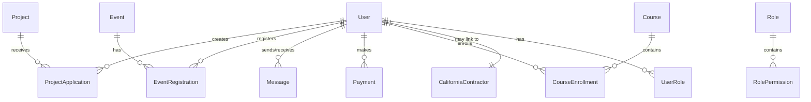

# NAMC NorCal Member Portal - System Architecture Design

## 📋 Executive Summary

This document provides a comprehensive system architecture design for the NAMC NorCal Member Portal, a digital platform serving minority contractors in Northern California. The architecture is designed to support 2,500+ active members, handle $100M+ in annual project opportunities, and maintain government contractor compliance standards.

## 🎯 Architecture Overview

### System Goals
- **Scalability**: Support 2,500+ concurrent users with sub-2-second response times
- **Reliability**: 99.9% uptime with automated failover and disaster recovery
- **Security**: Government contractor compliance (WCAG 2.1 AA, SOC 2, data encryption)
- **Performance**: Real-time updates, intelligent caching, optimized queries
- **Maintainability**: Modular architecture with clear separation of concerns

### Technology Stack Summary
```
Frontend:    Next.js 14.1.0 + React 18.2.0 + TypeScript 5.3.3
Backend:     Next.js API Routes + Express.js patterns
Database:    PostgreSQL 15 + Prisma 6.1.0 + PostGIS (geographic data)
Caching:     Redis + Next.js built-in caching
Storage:     AWS S3 (files) + CloudFront CDN
Search:      PostgreSQL Full-Text Search + Elasticsearch (future)
Security:    JWT + bcrypt + Rate limiting + CORS
Monitoring:  Application monitoring + Performance metrics
```

## 🏗️ System Architecture Layers

### 1. Client Layer (Presentation)
```
┌─────────────────────────────────────────────────────────────┐
│                    Client Applications                      │
├─────────────────────────────────────────────────────────────┤
│ • Next.js Web App (Primary)                                │
│ • Mobile Progressive Web App (PWA)                         │
│ • Admin Dashboard Interface                                 │
│ • API Documentation (OpenAPI/Swagger)                      │
└─────────────────────────────────────────────────────────────┘
```

**Key Features:**
- Server-Side Rendering (SSR) for SEO and performance
- Client-Side Rendering (CSR) for interactive components
- Progressive Web App capabilities for mobile experience
- Accessibility-first design (WCAG 2.1 AA compliance)

### 2. Application Layer (Business Logic)
```
┌─────────────────────────────────────────────────────────────┐
│                  Next.js Application Server                 │
├─────────────────────────────────────────────────────────────┤
│ • API Routes (/api/*)                                       │
│ • Server Components (React Server Components)              │
│ • Middleware (Authentication, CORS, Rate Limiting)         │
│ • Background Jobs (Event processing, notifications)        │
└─────────────────────────────────────────────────────────────┘
```

**Core Services:**
- **Authentication Service**: JWT-based auth with 2FA support
- **Authorization Service**: Role-based access control (RBAC)
- **Member Management**: User profiles, membership tracking
- **Project Management**: Opportunity matching, application processing
- **Event Management**: Registration, capacity management
- **Communication**: Messaging, announcements, notifications
- **Payment Processing**: Stripe integration, invoicing
- **Analytics**: Usage tracking, business intelligence

### 3. Data Layer (Persistence)
```
┌─────────────────────────────────────────────────────────────┐
│                      Data Storage                           │
├─────────────────────────────────────────────────────────────┤
│ • PostgreSQL 15 (Primary Database)                         │
│ • PostGIS (Geographic data extension)                      │
│ • Redis (Session storage, caching)                         │
│ • AWS S3 (File storage, backups)                          │
│ • Elasticsearch (Future: Advanced search)                  │
└─────────────────────────────────────────────────────────────┘
```

### 4. External Integration Layer
```
┌─────────────────────────────────────────────────────────────┐
│                  External Services                          │
├─────────────────────────────────────────────────────────────┤
│ • CSLB API (California contractor data)                    │
│ • Stripe API (Payment processing)                          │
│ • Email Services (SendGrid/SES)                           │
│ • SMS Services (Twilio)                                   │
│ • CDN (CloudFront for asset delivery)                     │
└─────────────────────────────────────────────────────────────┘
```

## 🔄 Data Flow Architecture

### Request Flow Pattern
```
Client Request → Next.js Middleware → API Route → Service Layer → Database → Response
```

### Authentication Flow
```
1. Client → POST /api/auth/login
2. Server validates credentials (bcrypt)
3. Generate JWT token (7-day expiration)
4. Store session in Redis
5. Return token + user data
6. Client stores token in httpOnly cookie
7. Subsequent requests include token in Authorization header
```

### Real-time Updates Flow
```
1. Database change triggers event
2. Server-Sent Events (SSE) notify connected clients
3. Client updates UI reactively
4. Optimistic updates for immediate feedback
```

## 📊 Database Architecture Design

### Core Entity Relationships



### Database Performance Optimization

**Indexing Strategy:**
```sql
-- Critical indexes for performance
CREATE INDEX CONCURRENTLY idx_users_email ON users(email);
CREATE INDEX CONCURRENTLY idx_users_member_type ON users(member_type);
CREATE INDEX CONCURRENTLY idx_projects_status_created ON projects(status, created_at);
CREATE INDEX CONCURRENTLY idx_projects_location_gist ON projects USING GIST(coordinates);
CREATE INDEX CONCURRENTLY idx_events_date_status ON events(start_date, status);
CREATE INDEX CONCURRENTLY idx_messages_participants ON messages(sender_id, receiver_id, sent_at);

-- Full-text search indexes
CREATE INDEX CONCURRENTLY idx_projects_fts ON projects USING gin(to_tsvector('english', title || ' ' || description));
CREATE INDEX CONCURRENTLY idx_users_fts ON users USING gin(to_tsvector('english', first_name || ' ' || last_name || ' ' || company));
```

**Partitioning Strategy:**
```sql
-- Partition large tables by date for better performance
-- AdminActions partitioned by month
-- SystemMetrics partitioned by day
-- Messages partitioned by quarter
```

## 🚀 Scalability Design Patterns

### Horizontal Scaling Architecture

```
┌─────────────────────────────────────────────────────────────┐
│                    Load Balancer                            │
├─────────────────────────────────────────────────────────────┤
│ • AWS Application Load Balancer                            │
│ • Health checks and auto-scaling triggers                  │
│ • SSL termination and security policies                    │
└─────────────────────────────────────────────────────────────┘
              │
    ┌─────────┼─────────┐
    │         │         │
┌───▼───┐ ┌───▼───┐ ┌───▼───┐
│App    │ │App    │ │App    │
│Server │ │Server │ │Server │
│  #1   │ │  #2   │ │  #3   │
└───────┘ └───────┘ └───────┘
              │
┌─────────────▼─────────────┐
│     Database Cluster      │
│ • Primary (Read/Write)    │
│ • Read Replicas (2-3)     │
│ • Automatic failover      │
└───────────────────────────┘
```

### Caching Strategy

**Multi-Layer Caching:**
```
1. Browser Cache (Static assets: 1 year)
2. CDN Cache (Images, JS, CSS: 30 days)
3. Next.js Cache (Pages, API responses: 1 hour)
4. Redis Cache (Sessions, queries: 15 minutes)
5. Database Query Cache (Frequent queries: 5 minutes)
```

**Cache Invalidation Patterns:**
```typescript
// Smart cache invalidation
const invalidateCachePatterns = {
  userUpdate: ['user:{userId}', 'member-directory', 'user-list'],
  projectCreate: ['projects-list', 'project-search', 'dashboard-metrics'],
  eventRegister: ['event:{eventId}', 'user-events:{userId}', 'event-capacity']
}
```

### Performance Optimization

**Database Query Optimization:**
```typescript
// Efficient pagination with cursor-based approach
const getProjectsPaginated = async (cursor?: string, limit = 20) => {
  return await prisma.project.findMany({
    where: cursor ? { id: { gt: cursor } } : undefined,
    take: limit + 1,
    orderBy: { createdAt: 'desc' },
    include: {
      createdBy: { select: { firstName: true, lastName: true, company: true } },
      _count: { select: { projectApplications: true } }
    }
  })
}

// Optimized search with full-text search
const searchProjects = async (query: string) => {
  return await prisma.$queryRaw`
    SELECT *, ts_rank(search_vector, query) as rank
    FROM projects, to_tsquery('english', ${query}) query
    WHERE search_vector @@ query
    ORDER BY rank DESC, created_at DESC
    LIMIT 20
  `
}
```

## 🔒 Security Architecture Design

### Security Layers

```
┌─────────────────────────────────────────────────────────────┐
│                   Security Perimeter                        │
├─────────────────────────────────────────────────────────────┤
│ • WAF (Web Application Firewall)                           │
│ • DDoS Protection                                          │
│ • Rate Limiting (100 req/min per IP)                      │
│ • CORS Policy enforcement                                  │
└─────────────────────────────────────────────────────────────┘
                          │
┌─────────────────────────▼─────────────────────────────────────┐
│                Application Security                           │
├───────────────────────────────────────────────────────────────┤
│ • JWT Authentication (7-day expiration)                      │
│ • Role-Based Access Control (RBAC)                          │
│ • Input validation (Zod schemas)                            │
│ • SQL injection prevention (Prisma ORM)                     │
│ • XSS protection (Content Security Policy)                  │
│ • CSRF protection (SameSite cookies)                        │
└───────────────────────────────────────────────────────────────┘
                          │
┌─────────────────────────▼─────────────────────────────────────┐
│                  Data Security                               │
├───────────────────────────────────────────────────────────────┤
│ • Encryption at rest (AES-256)                              │
│ • Encryption in transit (TLS 1.3)                           │
│ • Database access controls                                   │
│ • Audit logging (all admin actions)                         │
│ • Data backup and recovery                                   │
└───────────────────────────────────────────────────────────────┘
```

### Authentication & Authorization

**JWT Token Structure:**
```typescript
interface JWTPayload {
  userId: string
  email: string
  memberType: 'REGULAR' | 'admin'
  roles: string[]
  permissions: string[]
  iat: number // issued at
  exp: number // expires at
}
```

**Permission-Based Authorization:**
```typescript
const permissions = {
  'projects.create': ['admin', 'project_manager'],
  'projects.read': ['admin', 'member', 'project_manager'],
  'events.manage': ['admin', 'event_manager'],
  'users.manage': ['admin'],
  'analytics.view': ['admin', 'analytics_viewer']
}
```

## 📡 API Architecture Design

### RESTful API Structure

```
/api/
├── auth/
│   ├── login
│   ├── register
│   ├── logout
│   ├── forgot-password
│   └── verify-email
├── users/
│   ├── [id]
│   ├── profile
│   └── preferences
├── projects/
│   ├── [id]/
│   │   ├── applications
│   │   └── files
│   ├── search
│   └── categories
├── events/
│   ├── [id]/
│   │   ├── register
│   │   └── attendees
│   └── calendar
├── messages/
│   ├── [id]
│   ├── conversations
│   └── send
├── admin/
│   ├── users/
│   ├── analytics/
│   └── system/
└── webhooks/
    ├── stripe
    └── external-integrations
```

### API Response Standards

**Consistent Response Format:**
```typescript
interface APIResponse<T> {
  success: boolean
  data?: T
  message: string
  errors?: ValidationError[]
  meta?: {
    pagination?: PaginationMeta
    timestamp: string
    requestId: string
  }
}

interface PaginationMeta {
  page: number
  limit: number
  total: number
  totalPages: number
  hasNext: boolean
  hasPrev: boolean
}
```

### Error Handling Strategy

```typescript
class APIError extends Error {
  constructor(
    public statusCode: number,
    public message: string,
    public code?: string,
    public details?: any
  ) {
    super(message)
  }
}

const errorCodes = {
  VALIDATION_ERROR: 400,
  UNAUTHORIZED: 401,
  FORBIDDEN: 403,
  NOT_FOUND: 404,
  RATE_LIMITED: 429,
  INTERNAL_ERROR: 500
}
```

## 🧩 Component Architecture Design

### Frontend Component Hierarchy

```
src/
├── app/                      # Next.js 14 App Router
│   ├── (auth)/              # Authentication routes
│   ├── (dashboard)/         # Member dashboard
│   ├── admin/               # Admin interface
│   ├── api/                 # API routes
│   └── globals.css          # Global styles
├── components/
│   ├── ui/                  # Base UI components
│   │   ├── sets/            # Design system variants
│   │   │   ├── professional/
│   │   │   ├── minimalist/
│   │   │   └── dynamic/
│   │   ├── button.tsx
│   │   ├── card.tsx
│   │   ├── input.tsx
│   │   └── data-table.tsx
│   ├── layout/              # Layout components
│   │   ├── header.tsx
│   │   ├── footer.tsx
│   │   └── sidebar.tsx
│   ├── forms/               # Form components
│   ├── charts/              # Data visualization
│   └── providers.tsx        # Context providers
├── lib/                     # Utility libraries
│   ├── auth.ts             # Authentication logic
│   ├── prisma.ts           # Database client
│   ├── utils.ts            # Utility functions
│   └── validations.ts      # Zod schemas
├── hooks/                   # Custom React hooks
├── types/                   # TypeScript definitions
└── design-system/           # Design system tokens
```

### Design System Architecture

**Component Variants Strategy:**
```typescript
// Three design variants for different contexts
type DesignVariant = 'professional' | 'minimalist' | 'dynamic'

// Professional: Government contractor compliance, accessibility-first
// Minimalist: Clean, modern, mobile-optimized
// Dynamic: Interactive, engaging, event-focused

interface ComponentProps {
  variant?: DesignVariant
  size?: 'sm' | 'md' | 'lg' | 'xl'
  className?: string
}
```

**Component Composition Pattern:**
```typescript
// Compound component pattern for complex UI
const DataTable = {
  Root: DataTableRoot,
  Header: DataTableHeader,
  Body: DataTableBody,
  Row: DataTableRow,
  Cell: DataTableCell,
  Pagination: DataTablePagination,
  Search: DataTableSearch,
  Filter: DataTableFilter
}

// Usage
<DataTable.Root>
  <DataTable.Search />
  <DataTable.Filter />
  <DataTable.Header />
  <DataTable.Body />
  <DataTable.Pagination />
</DataTable.Root>
```

## 🔄 State Management Architecture

### State Management Strategy

```typescript
// Zustand stores for different domains
interface AuthStore {
  user: User | null
  token: string | null
  login: (token: string, user: User) => void
  logout: () => void
  updateUser: (updates: Partial<User>) => void
}

interface ProjectStore {
  projects: Project[]
  selectedProject: Project | null
  filters: ProjectFilters
  setProjects: (projects: Project[]) => void
  addProject: (project: Project) => void
  updateProject: (id: string, updates: Partial<Project>) => void
}

interface NotificationStore {
  notifications: Notification[]
  unreadCount: number
  addNotification: (notification: Notification) => void
  markAsRead: (id: string) => void
  clearAll: () => void
}
```

### Data Fetching Strategy

```typescript
// React Query for server state management
const useProjects = (filters?: ProjectFilters) => {
  return useQuery({
    queryKey: ['projects', filters],
    queryFn: () => fetchProjects(filters),
    staleTime: 5 * 60 * 1000, // 5 minutes
    cacheTime: 10 * 60 * 1000, // 10 minutes
  })
}

// Optimistic updates for better UX
const useCreateProject = () => {
  const queryClient = useQueryClient()
  
  return useMutation({
    mutationFn: createProject,
    onMutate: async (newProject) => {
      // Optimistically update the cache
      await queryClient.cancelQueries(['projects'])
      const previousProjects = queryClient.getQueryData(['projects'])
      queryClient.setQueryData(['projects'], (old: Project[]) => [
        { ...newProject, id: 'temp-' + Date.now() },
        ...old
      ])
      return { previousProjects }
    },
    onError: (err, newProject, context) => {
      // Rollback on error
      queryClient.setQueryData(['projects'], context.previousProjects)
    },
    onSettled: () => {
      // Refetch to ensure consistency
      queryClient.invalidateQueries(['projects'])
    }
  })
}
```

## 📈 Monitoring & Analytics Architecture

### Application Monitoring

```
┌─────────────────────────────────────────────────────────────┐
│                  Monitoring Stack                           │
├─────────────────────────────────────────────────────────────┤
│ • Application Performance Monitoring (APM)                 │
│ • Error Tracking and Alerting                             │
│ • Real User Monitoring (RUM)                              │
│ • Infrastructure Monitoring                               │
│ • Log Aggregation and Analysis                            │
└─────────────────────────────────────────────────────────────┘
```

**Key Metrics to Track:**
```typescript
interface SystemMetrics {
  // Performance metrics
  responseTime: number        // API response times
  throughput: number         // Requests per second
  errorRate: number          // Error percentage
  uptime: number            // System availability
  
  // Business metrics
  activeUsers: number        // Daily/monthly active users
  projectViews: number       // Project opportunity views
  applicationRate: number    // Project application success rate
  eventAttendance: number    // Event registration and attendance
  
  // Technical metrics
  databaseConnections: number // DB connection pool usage
  cacheHitRate: number       // Cache effectiveness
  cpuUtilization: number     // Server resource usage
  memoryUtilization: number  // Memory consumption
}
```

### Analytics Data Collection

```typescript
// Event tracking for business intelligence
interface AnalyticsEvent {
  event: string
  userId?: string
  properties: Record<string, any>
  timestamp: Date
}

const trackEvent = (event: string, properties: Record<string, any>) => {
  // Track user interactions for business insights
  analytics.track(event, {
    ...properties,
    userId: user?.id,
    sessionId: session.id,
    userAgent: navigator.userAgent,
    timestamp: new Date().toISOString()
  })
}

// Business intelligence queries
const businessMetrics = {
  memberGrowthRate: () => calculateMonthlyGrowth('users'),
  projectEngagementRate: () => calculateEngagement('projects'),
  eventAttendanceRate: () => calculateAttendance('events'),
  memberRetentionRate: () => calculateRetention('users'),
  revenueMetrics: () => calculateRevenue('payments')
}
```

## 🚀 Deployment Architecture

### Infrastructure as Code

```yaml
# docker-compose.yml - Development environment
version: '3.8'
services:
  app:
    build: .
    ports:
      - "3000:3000"
    environment:
      - DATABASE_URL=${DATABASE_URL}
      - REDIS_URL=${REDIS_URL}
    depends_on:
      - postgres
      - redis
  
  postgres:
    image: postgres:15-alpine
    environment:
      - POSTGRES_DB=namc_portal
      - POSTGRES_USER=${DB_USER}
      - POSTGRES_PASSWORD=${DB_PASSWORD}
    volumes:
      - postgres_data:/var/lib/postgresql/data
    ports:
      - "5432:5432"
  
  redis:
    image: redis:7-alpine
    ports:
      - "6379:6379"
    command: redis-server --appendonly yes
    volumes:
      - redis_data:/data

volumes:
  postgres_data:
  redis_data:
```

### Production Deployment Strategy

```
┌─────────────────────────────────────────────────────────────┐
│                   Production Environment                     │
├─────────────────────────────────────────────────────────────┤
│ • AWS/Vercel hosting with auto-scaling                     │
│ • Multi-zone deployment for high availability             │
│ • Blue-green deployment for zero downtime                 │
│ • Automated health checks and rollback                    │
│ • CDN for global content delivery                         │
└─────────────────────────────────────────────────────────────┘
```

**CI/CD Pipeline:**
```yaml
# .github/workflows/deploy.yml
name: Deploy to Production
on:
  push:
    branches: [main]
jobs:
  test:
    runs-on: ubuntu-latest
    steps:
      - uses: actions/checkout@v3
      - name: Run tests
        run: |
          npm ci
          npm run type-check
          npm run lint
          npm test
  
  deploy:
    needs: test
    runs-on: ubuntu-latest
    steps:
      - name: Deploy to production
        run: |
          # Database migrations
          npm run db:migrate
          # Build and deploy
          npm run build
          # Health check
          npm run health-check
```

## 🎯 Implementation Roadmap

### Phase 1: Core Infrastructure (Weeks 1-4)
- [ ] Set up Next.js 14 application with TypeScript
- [ ] Configure PostgreSQL database with Prisma
- [ ] Implement authentication system (JWT + bcrypt)
- [ ] Create basic user management
- [ ] Set up Redis caching layer
- [ ] Implement rate limiting and security middleware

### Phase 2: Core Features (Weeks 5-12)
- [ ] Member dashboard and profiles
- [ ] Project management system
- [ ] Event management and registration
- [ ] Basic messaging system
- [ ] Payment integration (Stripe)
- [ ] Admin panel for user management

### Phase 3: Advanced Features (Weeks 13-20)
- [ ] California contractor database integration
- [ ] Advanced search and filtering
- [ ] Learning management system
- [ ] Analytics and reporting
- [ ] Advanced messaging and notifications
- [ ] Mobile PWA optimization

### Phase 4: Scale & Optimize (Weeks 21-24)
- [ ] Performance optimization
- [ ] Advanced caching strategies
- [ ] Monitoring and alerting setup
- [ ] Security audit and penetration testing
- [ ] Load testing and optimization
- [ ] Production deployment and go-live

## 📚 Technical Standards & Best Practices

### Code Quality Standards
- **TypeScript**: Strict mode enabled, no `any` types
- **ESLint**: Next.js configuration with custom rules
- **Prettier**: Consistent code formatting
- **Testing**: 80%+ code coverage with Jest and React Testing Library
- **Documentation**: TSDoc comments for all public APIs

### Database Standards
- **Naming**: snake_case for tables/columns, camelCase for Prisma models
- **Indexes**: All foreign keys indexed, performance-critical queries optimized
- **Migrations**: Reversible migrations, no data loss
- **Backup**: Automated daily backups with point-in-time recovery

### Security Standards
- **OWASP**: Follow OWASP Top 10 security guidelines
- **Authentication**: JWT with secure httpOnly cookies
- **Authorization**: Role-based access control (RBAC)
- **Input Validation**: Zod schemas for all API inputs
- **Audit Logging**: All admin actions and sensitive operations logged

### Performance Standards
- **Page Load**: <2 seconds for 95th percentile
- **API Response**: <500ms for 95th percentile
- **Database Queries**: <100ms for 95th percentile
- **Cache Hit Rate**: >80% for frequently accessed data
- **Uptime**: 99.9% availability target

## 🔚 Conclusion

This system architecture provides a scalable, secure, and maintainable foundation for the NAMC NorCal Member Portal. The modular design allows for incremental development and future enhancements while maintaining high performance and government contractor compliance standards.

The architecture supports the platform's goal of serving 2,500+ active members with access to $100M+ in annual project opportunities while providing a modern, accessible, and efficient user experience.

---

*This document will be updated as the system evolves and new requirements emerge. For technical questions or clarifications, refer to the implementation guides and API documentation.*