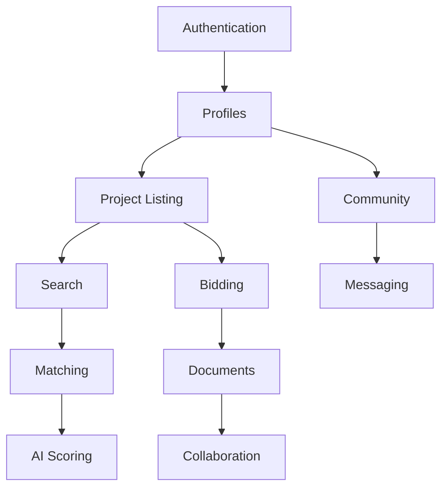

# NAMC NorCal Digital Platform - Complete Context Engineering Documentation

## Table of Contents
1. [Project Overview](#project-overview)
2. [Code Style Guide](#code-style-guide)
3. [Technical Stack](#technical-stack)
4. [System Architecture](#system-architecture)
5. [AI Implementation Context](#ai-implementation-context)
6. [Product Overview](#product-overview)
7. [Product Features](#product-features)
8. [User Personas](#user-personas)
9. [Product Roadmap](#product-roadmap)
10. [Design Patterns](#design-patterns)
11. [Cursor Rules](#cursor-rules)

---

# Project Overview

## Project Overview
The NAMC NorCal Digital Platform is a comprehensive business ecosystem designed to connect minority contractors with construction opportunities across all sectors (commercial, industrial, residential, and specialty). The platform automates member recruitment, provides AI-powered business tools, and demonstrates measurable impact to sponsors.

## Key Business Objectives
1. Scale NAMC operations by automating manual processes
2. Connect minority contractors to $100M+ in project opportunities annually
3. Achieve 750+ new members per year through automated recruitment
4. Maintain 90% sponsor retention through demonstrated ROI
5. Reduce administrative overhead by 50%

## Target Users
- **Members**: Minority contractors seeking projects, training, and business growth
- **Sponsors**: Corporations and agencies needing supplier diversity metrics
- **Admins**: NAMC staff managing operations and member services
- **Public**: Project owners seeking qualified minority contractors

## Core Value Propositions
- **For Contractors**: Find and win more projects with AI-powered matching
- **For Sponsors**: Track and demonstrate DEI impact in real-time
- **For NAMC**: Scale operations efficiently while maintaining quality
- **For Community**: Create jobs and economic opportunity

## Success Metrics
- 15% project win rate (vs 10% industry average)
- $3M annual platform revenue by Year 3
- 2,500 active members by Year 3
- 90% sponsor retention rate

---

# Code Style Guide

## General Principles
- Write self-documenting code with clear variable and function names
- Favor composition over inheritance
- Keep functions small and focused (single responsibility)
- Use TypeScript for type safety
- Mobile-first responsive design

## Naming Conventions
- **Variables/Functions**: camelCase (e.g., `getUserProjects`, `matchScore`)
- **Components**: PascalCase (e.g., `ProjectCard`, `MemberDashboard`)
- **Constants**: UPPER_SNAKE_CASE (e.g., `MAX_UPLOAD_SIZE`, `API_TIMEOUT`)
- **Files**: kebab-case (e.g., `project-service.ts`, `member-profile.tsx`)
- **Database**: snake_case (e.g., `member_profiles`, `project_id`)

## TypeScript Standards
```typescript
// Always define interfaces for data structures
interface Member {
  id: string;
  companyName: string;
  certifications: Certification[];
  sectors: ConstructionSector[];
}

// Use enums for fixed values
enum ProjectStatus {
  DRAFT = 'draft',
  PUBLISHED = 'published',
  AWARDED = 'awarded',
  COMPLETED = 'completed'
}

// Prefer const assertions for literals
const MATCHING_WEIGHTS = {
  capabilities: 0.25,
  capacity: 0.20,
  geography: 0.15,
  performance: 0.20,
  relationships: 0.10,
  certifications: 0.10
} as const;
```

## React/Next.js Standards
```typescript
// Use functional components with TypeScript
interface ProjectCardProps {
  project: Project;
  onApply: (projectId: string) => void;
  matchScore?: number;
}

export const ProjectCard: FC<ProjectCardProps> = ({ 
  project, 
  onApply, 
  matchScore 
}) => {
  // Component logic
};

// Custom hooks for shared logic
const useProjectMatching = (memberId: string) => {
  // Hook implementation
};
```

## API Design
```typescript
// RESTful endpoints with consistent structure
GET    /api/v1/projects
GET    /api/v1/projects/:id
POST   /api/v1/projects
PUT    /api/v1/projects/:id
DELETE /api/v1/projects/:id

// Standard response format
{
  "success": boolean,
  "data": T | T[],
  "error": {
    "code": string,
    "message": string,
    "details": any
  },
  "meta": {
    "timestamp": string,
    "version": string,
    "requestId": string
  }
}
```

## Database Queries
```sql
-- Use clear aliases and formatting
SELECT 
  p.id AS project_id,
  p.title,
  p.sector,
  COUNT(b.id) AS bid_count,
  MAX(b.bid_amount) AS highest_bid
FROM projects p
LEFT JOIN bids b ON p.id = b.project_id
WHERE p.status = 'published'
  AND p.deadline > NOW()
GROUP BY p.id, p.title, p.sector
ORDER BY p.created_at DESC;
```

## Error Handling
```typescript
// Use custom error classes
class ProjectNotFoundError extends Error {
  constructor(projectId: string) {
    super(`Project ${projectId} not found`);
    this.name = 'ProjectNotFoundError';
  }
}

// Consistent error handling in API routes
try {
  const result = await projectService.getProject(id);
  return res.json({ success: true, data: result });
} catch (error) {
  if (error instanceof ProjectNotFoundError) {
    return res.status(404).json({
      success: false,
      error: {
        code: 'PROJECT_NOT_FOUND',
        message: error.message
      }
    });
  }
  // Handle other errors
}
```

## Testing Standards
```typescript
// Descriptive test names
describe('ProjectMatchingService', () => {
  describe('calculateMatchScore', () => {
    it('should return high score for perfect match', () => {
      // Test implementation
    });
    
    it('should penalize missing certifications', () => {
      // Test implementation
    });
  });
});
```

## Comments and Documentation
```typescript
/**
 * Calculates the match score between a member and project
 * @param member - The member profile with capabilities
 * @param project - The project requirements
 * @returns Match score between 0-100
 */
export const calculateMatchScore = (
  member: Member, 
  project: Project
): number => {
  // Implementation
};
```

---

# Technical Stack

## Frontend
- **Framework**: Next.js 14 (App Router)
- **UI Library**: React 18
- **Styling**: Tailwind CSS + Radix UI
- **State Management**: Zustand
- **Data Fetching**: React Query (TanStack Query)
- **Forms**: React Hook Form + Zod validation
- **Maps**: Mapbox GL JS
- **Charts**: Recharts
- **Mobile**: React Native (iOS/Android apps)

## Backend
- **Runtime**: Node.js 20 LTS
- **Framework**: Express.js with TypeScript
- **API**: REST + GraphQL (Apollo Server)
- **Database**: PostgreSQL 15 with PostGIS
- **Caching**: Redis 7
- **Queue**: Bull (Redis-based)
- **Search**: Elasticsearch 8
- **File Storage**: AWS S3

## Infrastructure
- **Cloud Provider**: AWS (Primary), GCP (Disaster Recovery)
- **Containers**: Docker + Kubernetes (EKS)
- **CI/CD**: GitHub Actions
- **Monitoring**: Datadog, Sentry
- **CDN**: CloudFront
- **Load Balancer**: AWS ALB

## AI/ML Stack
- **LLM**: OpenAI GPT-4 API
- **Embeddings**: OpenAI Ada
- **ML Platform**: AWS SageMaker
- **Vector Database**: Pinecone
- **Model Management**: MLflow
- **Local Models**: LM Studio

## Third-Party Services
- **Authentication**: Auth0
- **Payments**: Stripe
- **Email**: SendGrid
- **SMS**: Twilio
- **Documents**: DocuSign
- **Analytics**: Mixpanel, Google Analytics
- **Error Tracking**: Sentry

## Development Tools
- **IDE**: VS Code with recommended extensions
- **Version Control**: Git + GitHub
- **API Testing**: Postman
- **Database GUI**: TablePlus
- **Design**: Figma

## Key Integrations
```javascript
// Construction Industry
- SAM.gov (Federal projects)
- Caltrans (State projects)
- CSLB (License verification)
- Dodge Data (Private projects)

// Green Building Programs
- PG&E API (Utility programs)
- TECH Clean CA (Training)
- SnuggPro (Energy modeling)
- Rewiring America (Electrification)

// Business Intelligence
- ArcGIS Business Analyst
- ProspectNow (Property data)
- Shovels AI (Construction intel)
- D&B (Credit verification)
```

## Security Standards
- **Encryption**: AES-256 (at rest), TLS 1.3 (in transit)
- **Authentication**: OAuth 2.0 + JWT
- **API Security**: Rate limiting, API keys
- **Compliance**: SOC 2, GDPR, CCPA
- **Secrets Management**: AWS Secrets Manager

## Performance Targets
- **Page Load**: < 2 seconds (95th percentile)
- **API Response**: < 200ms (median)
- **Uptime**: 99.9% SLA
- **Concurrent Users**: 10,000+
- **Database Queries**: < 100ms

---

# System Architecture

## High-Level Architecture
```
┌─────────────────────────────────────────────────────────┐
│                   CloudFront CDN                         │
├─────────────────────────────────────────────────────────┤
│                   Load Balancer (ALB)                    │
├──────────────────┬──────────────────────────────────────┤
│   Web App        │         API Gateway                  │
│  (Next.js)       │    (Rate Limiting, Auth)            │
├──────────────────┴──────────────────────────────────────┤
│                  Microservices Layer                     │
├────────┬────────┬────────┬────────┬────────┬───────────┤
│  User  │Project │Finance │  AI    │Sponsor │Analytics  │
│Service │Service │Service │Service │Service │Service    │
├────────┴────────┴────────┴────────┴────────┴───────────┤
│                    Data Layer                            │
├────────┬────────┬────────┬────────┬────────┬───────────┤
│Postgres│ Redis  │   S3   │Elastic │Pinecone│TimeSeries│
│  (RDS) │(Cache) │ (Files)│(Search)│(Vector)│(Metrics) │
└────────┴────────┴────────┴────────┴────────┴───────────┘
```

## Service Architecture

### User Service
- **Responsibilities**: Authentication, profiles, permissions
- **Database**: PostgreSQL (users, members, sponsors)
- **Cache**: Redis (sessions, permissions)
- **APIs**: Auth0, CSLB verification

### Project Service
- **Responsibilities**: Project CRUD, matching, bidding
- **Database**: PostgreSQL (projects, bids)
- **Search**: Elasticsearch
- **APIs**: SAM.gov, Caltrans, Dodge Data

### Financial Service
- **Responsibilities**: Payments, invoicing, financial tools
- **Database**: PostgreSQL (encrypted financial data)
- **APIs**: Stripe, Plaid, QuickBooks

### AI Service
- **Responsibilities**: Matching, bid assistance, insights
- **ML Models**: GPT-4, custom scoring models
- **Vector DB**: Pinecone for similarity search
- **Queue**: Bull for async processing

### Sponsor Service
- **Responsibilities**: Impact tracking, reporting
- **Database**: PostgreSQL (sponsor programs, metrics)
- **Analytics**: Time-series database for metrics

## Data Flow Examples

### Project Matching Flow
```
1. Member logs in → User Service validates
2. Member searches → Project Service queries
3. Search request → Elasticsearch returns candidates
4. Candidates → AI Service scores matches
5. Scored results → Returned to member
6. Member applies → Bid created in Project Service
7. Application → Notifications via Queue
```

### Sponsor Impact Flow
```
1. Project completed → Project Service updates
2. Update event → Analytics Service processes
3. Metrics calculated → Sponsor Service updates
4. Dashboard request → Real-time metrics returned
5. Report generated → PDF created and stored in S3
```

## Security Architecture
- **Network**: VPC with public/private subnets
- **API Gateway**: Rate limiting, API key validation
- **Authentication**: JWT tokens with refresh
- **Authorization**: Role-based (RBAC)
- **Data**: Encryption at rest and in transit
- **Secrets**: AWS Secrets Manager

## Scalability Strategy
- **Horizontal Scaling**: Kubernetes auto-scaling
- **Database**: Read replicas for queries
- **Caching**: Multi-tier (CDN, Redis, application)
- **Queue**: Distributed job processing
- **Search**: Elasticsearch cluster

## Disaster Recovery
- **Backup**: Daily automated backups
- **Recovery**: RTO 4 hours, RPO 1 hour
- **Replication**: Cross-region replication
- **Failover**: Automated health checks
- **Testing**: Quarterly DR drills

---

# AI Implementation Context

## AI Use Cases

### 1. Project-Member Matching
**Purpose**: Match contractors with relevant opportunities
**Implementation**:
```python
def calculate_match_score(member, project):
    """
    Calculates compatibility between member and project
    Weights:
    - Capabilities: 25%
    - Capacity: 20%
    - Geography: 15%
    - Past Performance: 20%
    - Relationships: 10%
    - Certifications: 10%
    """
    # Vector similarity for capabilities
    # Current capacity check
    # Geographic distance calculation
    # Historical performance analysis
    # Previous work with owner
    # Required certification matching
    return score (0-100)
```

### 2. Bid Assistant
**Purpose**: Help contractors prepare competitive bids
**Features**:
- Analyze RFP requirements
- Suggest pricing based on historicals
- Generate compliance matrices
- Create project schedules
- Write technical narratives

**Prompts Structure**:
```
System: You are an expert construction estimator and proposal writer.
Context: {project_details, member_capabilities, historical_data}
Task: Generate a {specific_document} that is competitive and compliant.
```

### 3. Financial Analysis
**Purpose**: Assess project profitability and cash flow
**Capabilities**:
- Working capital requirements
- Cash flow projections
- Risk assessment
- Pricing optimization

### 4. Impact Prediction
**Purpose**: Forecast sponsor program outcomes
**Models**:
- Job creation estimates
- Economic multiplier effects
- Timeline predictions
- Success probability

## AI Safety & Governance

### Confidence Thresholds
- **High (>85%)**: Direct display to user
- **Medium (60-85%)**: Display with caveats
- **Low (<60%)**: Refer to human expert

### Bias Mitigation
- Regular audits of matching algorithms
- Diverse training data
- Fairness metrics tracking
- Human review options

### Transparency
- Explainable scoring factors
- Audit trails for all AI decisions
- User feedback incorporation
- Regular model updates

## Implementation Guidelines

### API Integration
```typescript
interface AIServiceConfig {
  openai: {
    apiKey: process.env.OPENAI_API_KEY,
    model: 'gpt-4-turbo',
    temperature: 0.7,
    maxTokens: 2000
  },
  pinecone: {
    apiKey: process.env.PINECONE_API_KEY,
    environment: 'production',
    indexName: 'namc-projects'
  },
  customModels: {
    matchingModel: 's3://models/matching-v2.pkl',
    pricingModel: 's3://models/pricing-v1.pkl'
  }
}
```

### Prompt Templates
```typescript
const BID_ASSISTANT_PROMPT = `
Role: You are an experienced construction proposal writer specializing in {sector} projects.

Context:
- Project: {projectName} ({projectType})
- Owner: {ownerName} ({ownerType})
- Value: ${projectValue}
- Our Capabilities: {memberCapabilities}
- Past Similar Projects: {relevantExperience}

Task: {specificTask}

Requirements:
- Professional tone
- Highlight relevant experience
- Address all RFP requirements
- Include win themes
- Stay within {wordLimit} words
`;
```

### Performance Monitoring
- Response time tracking
- Accuracy measurements
- User satisfaction scores
- Cost per request
- Error rates and types

## Training Data Sources
- Historical bid data (anonymized)
- Project outcome records
- Industry benchmarks
- Government databases
- Partner-provided datasets

## Continuous Improvement
- Weekly model performance reviews
- Monthly user feedback analysis
- Quarterly model retraining
- Annual bias audits

---

# Product Overview

## Product Vision
Create the operating system for minority contractor success - a comprehensive digital ecosystem that removes barriers and accelerates growth for minority-owned construction businesses.

## Core Product Principles
1. **Accessibility First**: Simple enough for non-technical contractors
2. **Mobile-Optimized**: 60%+ of users will be on mobile devices
3. **Action-Oriented**: Every screen should drive toward winning projects
4. **Data-Driven**: Show metrics that matter to each user type
5. **Trust & Security**: Handle sensitive business data with care

## Key User Flows

### Member Journey
1. **Discovery**: Find NAMC through search, referral, or partner
2. **Application**: Complete profile in <10 minutes
3. **Onboarding**: Guided setup with quick wins
4. **Daily Use**: Check matches, submit bids, track progress
5. **Growth**: Access training, financing, larger projects
6. **Advocacy**: Refer others, share success stories

### Sponsor Journey
1. **Partnership**: Agree to sponsor level and benefits
2. **Setup**: Create branded presence and programs
3. **Engagement**: Post opportunities, message contractors
4. **Tracking**: Monitor real-time impact metrics
5. **Reporting**: Generate compliance and impact reports
6. **Renewal**: Expand partnership based on ROI

## Feature Prioritization Framework
- **P0 (MVP)**: Core functionality required for launch
- **P1 (Growth)**: Features that drive adoption and retention
- **P2 (Scale)**: Advanced features for mature platform
- **P3 (Delight)**: Nice-to-have enhancements

## Success Metrics
- **Activation**: 70% complete profile within 7 days
- **Engagement**: 40% DAU/MAU ratio
- **Retention**: 85% annual renewal rate
- **Revenue**: $3M ARR by Year 3
- **Impact**: $100M in projects facilitated

---

# Product Features

## P0 Features (MVP - Month 1)

### Authentication & Profiles
- Email/password login
- Basic member profiles
- Role-based access (member, sponsor, admin)
- Password reset flow

### Project Management
- Project listing (manual entry)
- Basic search and filters
- Project details view
- Simple application process

### Admin Tools
- Member application review
- Basic analytics dashboard
- Email broadcast tool
- Content management

### Payments
- Stripe integration
- Membership fee collection
- Basic invoicing

## P1 Features (Growth - Months 2-6)

### Smart Matching
- AI-powered project matching
- Relevance scoring
- Saved searches and alerts
- Recommendation engine

### Business Tools
- Bid assistance templates
- Cost estimation calculators
- Document storage
- Team collaboration

### Learning Platform
- Course catalog integration
- Progress tracking
- Certification management
- Resource library

### Community
- Discussion forums
- Direct messaging
- Mentor matching
- Success story sharing

### Sponsor Portal
- Impact dashboard
- Program creation
- Branded pages
- Direct contractor outreach

## P2 Features (Scale - Months 7-9)

### Advanced Features
- Tool lending marketplace
- Equipment rental system
- Financial assistance tools
- Advanced analytics

### Mobile Apps
- iOS application
- Android application
- Offline capability
- Push notifications

### API Platform
- Public API
- Partner integrations
- Webhook system
- Rate limiting

### White Label
- Custom branding options
- Dedicated instances
- SSO integration
- Custom workflows

## P3 Features (Delight - Months 10-12)

### AI Enhancements
- Predictive analytics
- Natural language search
- Automated insights
- Chatbot support

### Gamification
- Achievement badges
- Leaderboards
- Referral rewards
- Progress celebrations

### Advanced Integrations
- QuickBooks sync
- Calendar integration
- CRM connectors
- Marketing automation

## Feature Dependencies


---

# User Personas

## Primary Personas

### 1. Maria - Growing Residential Contractor
**Background**
- Age: 42
- Business: 8-person residential construction company
- Experience: 15 years in construction, 5 as owner
- Tech comfort: Moderate (uses smartphone, basic software)
- Languages: English and Spanish

**Goals**
- Win larger multifamily projects
- Get certified for green building
- Access working capital
- Hire and train more workers

**Pain Points**
- Misses opportunities due to manual searching
- Struggles with complex bid requirements
- Limited time for training
- Cash flow challenges

**Platform Usage**
- Checks for new projects daily on mobile
- Uses bid templates and calculators
- Attends virtual training sessions
- Messages other contractors for advice

### 2. James - Commercial Specialist
**Background**
- Age: 38
- Business: 25-person commercial construction firm
- Experience: 20 years, focused on institutional projects
- Tech comfort: High (uses project management software)
- Focus: Schools, hospitals, government buildings

**Goals**
- Win more public sector projects
- Meet DBE requirements efficiently
- Scale to $10M+ projects
- Build strategic partnerships

**Pain Points**
- Complex compliance requirements
- Bonding capacity limitations
- Finding qualified subcontractors
- Tracking multiple bid deadlines

**Platform Usage**
- Advanced search with saved filters
- Collaborates on joint venture bids
- Tracks compliance metrics
- Uses API for integration

### 3. Sarah - New Entrepreneur
**Background**
- Age: 29
- Business: Just started, 2-person team
- Experience: 5 years as project manager
- Tech comfort: Very high (digital native)
- Focus: Specialty trades, green building

**Goals**
- Get first contracts
- Build reputation
- Learn business skills
- Find mentorship

**Pain Points**
- No track record
- Limited capital
- Overwhelming requirements
- Needs guidance

**Platform Usage**
- Completes all training modules
- Active in community forums
- Uses AI assistant heavily
- Seeks mentor connections

## Sponsor Personas

### 4. Tech Corp - Diversity Champion
**Background**
- Company: Fortune 500 tech company
- Contact: Supplier Diversity Manager
- Budget: $2M annual construction spend
- Goals: 25% diverse supplier spend

**Needs**
- Find qualified local contractors
- Track spending by category
- Generate board reports
- Show community impact

**Platform Usage**
- Monthly impact dashboard review
- Posts facility maintenance projects
- Sponsors training programs
- Hosts contractor events

### 5. Transit Agency - Compliance Focus
**Background**
- Organization: Regional transit authority
- Contact: DBE Compliance Officer
- Budget: $500M capital program
- Requirement: 25% DBE participation

**Needs**
- Verify contractor certifications
- Track participation accurately
- Meet federal requirements
- Build contractor capacity

**Platform Usage**
- Daily compliance monitoring
- Automated report generation
- Contractor performance tracking
- Capacity building programs

## Admin Personas

### 6. NAMC Staff - Operations Manager
**Background**
- Role: Member services and operations
- Experience: 5 years with NAMC
- Responsibilities: Applications, support, events
- Tech comfort: Moderate

**Goals**
- Process applications quickly
- Support member success
- Reduce manual work
- Show organizational impact

**Pain Points**
- Repetitive manual tasks
- Disconnected systems
- Member support volume
- Report generation time

**Platform Usage**
- Daily application review
- Member communication
- Event management
- Analytics monitoring

## Persona Priority Matrix

| Persona | Revenue Impact | Volume | Priority |
|---------|---------------|---------|----------|
| Maria | High | High | P0 |
| James | Very High | Medium | P0 |
| Sarah | Medium | High | P1 |
| Tech Corp | Very High | Low | P0 |
| Transit Agency | High | Medium | P1 |
| NAMC Staff | Enabler | Low | P0 |

---

# Product Roadmap

## Development Phases Overview

### Phase 0: Foundation (Month 1)
**Goal**: Launch MVP with core functionality
**Success Metric**: 50 beta users onboarded

### Phase 1: Core Platform (Months 2-3)
**Goal**: Essential features for daily use
**Success Metric**: 200 active members, 5 sponsors

### Phase 2: Intelligence (Months 4-6)
**Goal**: Add AI and automation
**Success Metric**: 15% project win rate

### Phase 3: Scale (Months 7-9)
**Goal**: Advanced features and mobile
**Success Metric**: 750 members, $100K MRR

### Phase 4: Optimize (Months 10-12)
**Goal**: Performance and expansion
**Success Metric**: Ready for Series A

## Detailed Roadmap

### Month 1: MVP Launch
**Week 1-2**
- [ ] User authentication system
- [ ] Basic member profiles
- [ ] Project listing interface
- [ ] Admin application review

**Week 3-4**
- [ ] Payment processing (Stripe)
- [ ] Email notifications
- [ ] Basic search functionality
- [ ] Beta user onboarding

### Month 2: Member Experience
**Week 5-6**
- [ ] Enhanced profiles (certifications, portfolio)
- [ ] Advanced search and filters
- [ ] Saved searches
- [ ] Mobile responsive design

**Week 7-8**
- [ ] Community forums launch
- [ ] Direct messaging
- [ ] Email digest system
- [ ] Basic analytics

### Month 3: Sponsor Features
**Week 9-10**
- [ ] Sponsor portal v1
- [ ] Impact metrics dashboard
- [ ] Opportunity posting
- [ ] Branded pages

**Week 11-12**
- [ ] Admin dashboard v2
- [ ] Bulk operations
- [ ] Basic reporting
- [ ] Performance optimization

### Month 4: AI Integration
**Week 13-14**
- [ ] Project matching algorithm
- [ ] Relevance scoring
- [ ] AI bid assistant beta
- [ ] Smart notifications

**Week 15-16**
- [ ] Recommendation engine
- [ ] Predictive analytics
- [ ] Natural language search
- [ ] A/B testing framework

### Month 5: Business Tools
**Week 17-18**
- [ ] Financial calculators
- [ ] Document templates
- [ ] Cost estimation tools
- [ ] Bid tracking

**Week 19-20**
- [ ] Team collaboration
- [ ] Document versioning
- [ ] Integration APIs
- [ ] Workflow automation

### Month 6: Learning Platform
**Week 21-22**
- [ ] LMS integration
- [ ] Course catalog
- [ ] Progress tracking
- [ ] Certificates

**Week 23-24**
- [ ] Mentor matching
- [ ] Resource library
- [ ] Virtual events
- [ ] Knowledge base

### Month 7: Mobile Launch
**Week 25-26**
- [ ] iOS app beta
- [ ] Android app beta
- [ ] Push notifications
- [ ] Offline mode

**Week 27-28**
- [ ] App store launch
- [ ] Mobile onboarding
- [ ] Location services
- [ ] Camera integration

### Month 8: Marketplace Features
**Week 29-30**
- [ ] Tool lending system
- [ ] Equipment catalog
- [ ] Booking system
- [ ] Payment processing

**Week 31-32**
- [ ] Review system
- [ ] Insurance verification
- [ ] Logistics coordination
- [ ] Damage tracking

### Month 9: Advanced Analytics
**Week 33-34**
- [ ] Custom dashboards
- [ ] Predictive models
- [ ] ROI calculators
- [ ] Market insights

**Week 35-36**
- [ ] API v2 launch
- [ ] Webhook system
- [ ] Partner portal
- [ ] White label beta

### Month 10-12: Scale & Optimize
**Ongoing**
- [ ] Performance optimization
- [ ] Geographic expansion
- [ ] Enterprise features
- [ ] Advanced AI
- [ ] Strategic partnerships
- [ ] Series A preparation

## Release Cycles
- **Production Releases**: Bi-weekly (Thursday evenings)
- **Beta Features**: Weekly to beta group
- **Hotfixes**: As needed
- **Mobile Updates**: Monthly

## Success Metrics by Phase

| Phase | Members | Revenue | Win Rate | Satisfaction |
|-------|---------|---------|-----------|--------------|
| 0 | 50 | $0 | Baseline | N/A |
| 1 | 200 | $20K | 10% | 4.0/5 |
| 2 | 500 | $50K | 13% | 4.3/5 |
| 3 | 750 | $100K | 15% | 4.5/5 |
| 4 | 1000 | $150K | 17% | 4.6/5 |

---

# Design Patterns

## Authentication Pattern
```typescript
// Use JWT with refresh tokens
interface AuthTokens {
  accessToken: string;  // 15 min expiry
  refreshToken: string; // 30 day expiry
}

// Middleware for protected routes
export const requireAuth = (roles?: UserRole[]) => {
  return async (req: Request, res: Response, next: NextFunction) => {
    const token = req.headers.authorization?.split(' ')[1];
    if (!token) return res.status(401).json({ error: 'Unauthorized' });
    
    try {
      const payload = jwt.verify(token, process.env.JWT_SECRET);
      if (roles && !roles.includes(payload.role)) {
        return res.status(403).json({ error: 'Forbidden' });
      }
      req.user = payload;
      next();
    } catch (error) {
      return res.status(401).json({ error: 'Invalid token' });
    }
  };
};
```

## Repository Pattern
```typescript
// Base repository for common operations
export abstract class BaseRepository<T> {
  constructor(protected db: Database, protected tableName: string) {}

  async findById(id: string): Promise<T | null> {
    const result = await this.db
      .select('*')
      .from(this.tableName)
      .where('id', id)
      .andWhere('deleted_at', null)
      .first();
    return result || null;
  }

  async create(data: Partial<T>): Promise<T> {
    const [result] = await this.db
      .insert(data)
      .into(this.tableName)
      .returning('*');
    return result;
  }

  async update(id: string, data: Partial<T>): Promise<T> {
    const [result] = await this.db
      .update({ ...data, updated_at: new Date() })
      .table(this.tableName)
      .where('id', id)
      .returning('*');
    return result;
  }

  async softDelete(id: string): Promise<void> {
    await this.db
      .update({ deleted_at: new Date() })
      .table(this.tableName)
      .where('id', id);
  }
}

// Specific repository
export class MemberRepository extends BaseRepository<Member> {
  constructor(db: Database) {
    super(db, 'members');
  }

  async findByCertifications(certs: string[]): Promise<Member[]> {
    return this.db
      .select('*')
      .from(this.tableName)
      .whereRaw('certifications @> ?', [JSON.stringify(certs)])
      .andWhere('deleted_at', null);
  }
}
```

## Service Layer Pattern
```typescript
// Business logic in services
export class ProjectMatchingService {
  constructor(
    private projectRepo: ProjectRepository,
    private memberRepo: MemberRepository,
    private aiService: AIService
  ) {}

  async findMatches(memberId: string): Promise<ProjectMatch[]> {
    const member = await this.memberRepo.findById(memberId);
    if (!member) throw new NotFoundError('Member not found');

    const eligibleProjects = await this.projectRepo.findEligible(member);
    
    const matches = await Promise.all(
      eligibleProjects.map(async (project) => {
        const score = await this.aiService.calculateMatch(member, project);
        return { project, score, member };
      })
    );

    return matches
      .filter(m => m.score > 60)
      .sort((a, b) => b.score - a.score);
  }
}
```

## Error Handling Pattern
```typescript
// Custom error classes
export class AppError extends Error {
  constructor(
    public message: string,
    public statusCode: number,
    public code: string
  ) {
    super(message);
  }
}

export class NotFoundError extends AppError {
  constructor(message: string) {
    super(message, 404, 'NOT_FOUND');
  }
}

export class ValidationError extends AppError {
  constructor(message: string, public details: any) {
    super(message, 400, 'VALIDATION_ERROR');
  }
}

// Global error handler
export const errorHandler = (
  err: Error,
  req: Request,
  res: Response,
  next: NextFunction
) => {
  if (err instanceof AppError) {
    return res.status(err.statusCode).json({
      success: false,
      error: {
        code: err.code,
        message: err.message,
        ...(err instanceof ValidationError && { details: err.details })
      }
    });
  }

  // Log unexpected errors
  logger.error('Unexpected error:', err);
  
  return res.status(500).json({
    success: false,
    error: {
      code: 'INTERNAL_ERROR',
      message: 'An unexpected error occurred'
    }
  });
};
```

## Caching Pattern
```typescript
// Cache decorator
export function Cacheable(ttl: number = 300) {
  return function (target: any, propertyName: string, descriptor: PropertyDescriptor) {
    const method = descriptor.value;
    
    descriptor.value = async function (...args: any[]) {
      const cacheKey = `${target.constructor.name}:${propertyName}:${JSON.stringify(args)}`;
      
      // Check cache
      const cached = await redis.get(cacheKey);
      if (cached) return JSON.parse(cached);
      
      // Execute method
      const result = await method.apply(this, args);
      
      // Store in cache
      await redis.setex(cacheKey, ttl, JSON.stringify(result));
      
      return result;
    };
  };
}

// Usage
class ProjectService {
  @Cacheable(600) // 10 minutes
  async getPopularProjects(): Promise<Project[]> {
    return this.projectRepo.findPopular();
  }
}
```

## Event-Driven Pattern
```typescript
// Event emitter for domain events
export class DomainEvents {
  private static events: Map<string, Function[]> = new Map();

  static register(eventName: string, handler: Function) {
    if (!this.events.has(eventName)) {
      this.events.set(eventName, []);
    }
    this.events.get(eventName)!.push(handler);
  }

  static async emit(eventName: string, data: any) {
    const handlers = this.events.get(eventName) || [];
    
    for (const handler of handlers) {
      // Execute handlers asynchronously
      setImmediate(() => handler(data));
    }
  }
}

// Usage
DomainEvents.register('project.awarded', async (data) => {
  await notificationService.notifyWinner(data.memberId, data.projectId);
  await analyticsService.trackWin(data);
  await sponsorService.updateMetrics(data.sponsorId);
});

// Emit event
await DomainEvents.emit('project.awarded', {
  projectId,
  memberId,
  sponsorId,
  amount
});
```

## React Component Patterns
```typescript
// Custom hooks for data fetching
export function useProjects(filters: ProjectFilters) {
  return useQuery({
    queryKey: ['projects', filters],
    queryFn: () => projectApi.getProjects(filters),
    staleTime: 5 * 60 * 1000, // 5 minutes
  });
}

// Error boundary component
export class ErrorBoundary extends Component<Props, State> {
  state = { hasError: false, error: null };

  static getDerivedStateFromError(error: Error) {
    return { hasError: true, error };
  }

  componentDidCatch(error: Error, errorInfo: ErrorInfo) {
    logger.error('Component error:', error, errorInfo);
  }

  render() {
    if (this.state.hasError) {
      return <ErrorFallback error={this.state.error} />;
    }
    return this.props.children;
  }
}

// Optimistic updates
export function useOptimisticBid() {
  const queryClient = useQueryClient();
  
  return useMutation({
    mutationFn: bidApi.submitBid,
    onMutate: async (newBid) => {
      await queryClient.cancelQueries({ queryKey: ['bids'] });
      
      const previousBids = queryClient.getQueryData(['bids']);
      queryClient.setQueryData(['bids'], old => [...old, newBid]);
      
      return { previousBids };
    },
    onError: (err, newBid, context) => {
      queryClient.setQueryData(['bids'], context.previousBids);
    },
    onSettled: () => {
      queryClient.invalidateQueries({ queryKey: ['bids'] });
    },
  });
}
```

## Database Migration Pattern
```typescript
// Knex migration example
export async function up(knex: Knex): Promise<void> {
  await knex.schema.createTable('projects', (table) => {
    table.uuid('id').primary().defaultTo(knex.raw('gen_random_uuid()'));
    table.string('title', 500).notNullable();
    table.enum('sector', ['commercial', 'industrial', 'residential', 'specialty']);
    table.specificType('location', 'GEOGRAPHY(POINT, 4326)');
    table.jsonb('requirements').defaultTo('[]');
    table.decimal('value_min', 12, 2);
    table.decimal('value_max', 12, 2);
    table.timestamps(true, true);
    table.timestamp('deleted_at');
    
    // Indexes
    table.index(['sector', 'deleted_at']);
    table.index('location', undefined, 'gist');
  });
}

export async function down(knex: Knex): Promise<void> {
  await knex.schema.dropTable('projects');
}
```

---

# Cursor Rules

## Project Context
You are developing a comprehensive digital platform for NAMC NorCal that connects minority contractors with construction opportunities. The platform serves contractors, sponsors, administrators, and public users.

## Code Standards
- Use TypeScript for all new code
- Follow functional programming principles where appropriate
- Write self-documenting code with clear naming
- Keep functions small and focused
- Always handle errors gracefully
- Add JSDoc comments for public APIs

## Architecture Patterns
- Follow microservices architecture
- Use dependency injection
- Implement repository pattern for data access
- Apply SOLID principles
- Cache expensive operations
- Use event-driven patterns for async operations

## Database Guidelines
- Use PostgreSQL with proper indexes
- Implement soft deletes for audit trails
- Always use migrations for schema changes
- Encrypt sensitive data
- Use PostGIS for geographic queries

## API Design
- Follow RESTful conventions
- Version all APIs (/api/v1/)
- Return consistent response formats
- Implement proper error codes
- Add rate limiting
- Document with OpenAPI/Swagger

## Security Requirements
- Never store plaintext passwords
- Use parameterized queries
- Validate all inputs
- Implement RBAC
- Add audit logging
- Follow OWASP guidelines

## Testing Requirements
- Write unit tests for business logic
- Add integration tests for APIs
- Include E2E tests for critical flows
- Maintain >80% code coverage
- Test error scenarios
- Use meaningful test descriptions

## React/Next.js Patterns
- Use functional components
- Implement proper loading states
- Handle errors with boundaries
- Optimize with React.memo when needed
- Use Suspense for code splitting
- Follow accessibility guidelines

## Performance Considerations
- Implement pagination for lists
- Use database connection pooling
- Add caching layers appropriately
- Optimize images and assets
- Minimize bundle sizes
- Monitor Core Web Vitals

## AI Integration Guidelines
- Always include confidence scores
- Provide fallback options
- Log AI decisions for auditing
- Handle API failures gracefully
- Monitor costs and usage
- Allow human override options

## Development Workflow
- Create feature branches
- Write descriptive commit messages
- Update tests with code changes
- Document significant decisions
- Review performance impact
- Consider mobile users first